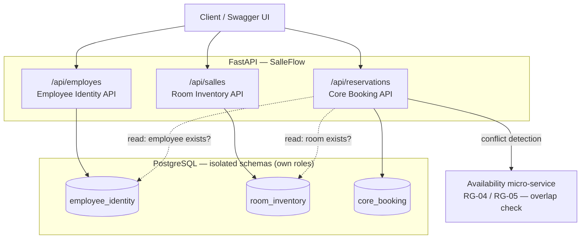

# SalleFlow — Meeting-room booking system

A meeting-room reservation platform built as a DevOps module project. The design
splits the domain into three APIs, each backed by its **own isolated PostgreSQL
schema with its own database role** — a least-privilege setup where only the
booking service can read across boundaries.

- **Backend**: FastAPI (Python)
- **Database**: PostgreSQL with three isolated schemas + Liquibase migrations
- **Observability**: Prometheus metrics + Grafana dashboards
- **Booking rules**: a dedicated availability micro-service for overlap detection

---

## Architecture



Each API owns one schema and one PostgreSQL role. Only `core_booking` is granted
**read** access to the other two — just enough to confirm that an employee and a
room actually exist before creating a booking. Nothing more. This mirrors how a
real system limits blast radius: a compromised service can only touch its own
data.

| Schema | API | Access |
|--------|-----|--------|
| `employee_identity` | Employee Identity API | own read/write |
| `room_inventory` | Room Inventory API | own read/write |
| `core_booking` | Core Booking API | own read/write + **read-only** on the two above |

---

## Preventing double bookings

Two people trying to book the same room for the same slot is the classic race
condition of any reservation system. SalleFlow delegates overlap detection to a
dedicated availability micro-service (rules RG-04 / RG-05) and ships a
**concurrency test** (`tests/test_concurrence.py`) that fires simultaneous
booking requests to verify the system doesn't accept conflicting reservations.

---

## Quick start

```bash
cp .env.example .env          # set the two passwords
docker compose up -d --build  # ~1 minute on first run
docker compose ps
curl http://localhost:8000/health
```

The health probe should return `{"statut":"ok","base":"ok","schemas":3}`.
If `schemas` is less than 3, a migration failed.

### Interfaces

| Service | URL |
|---------|-----|
| API + Swagger | http://localhost:8000/docs |
| Database (Adminer) | http://localhost:8081 |
| Dashboards (Grafana) | http://localhost:3000 |
| Metrics (Prometheus) | http://localhost:9090 |

Two containers run without a UI: `liquibase` applies the changelog then exits
`Exited (0)` (expected), and `postgres-exporter` exposes PostgreSQL state to
Prometheus.

---

## Repository layout

```
app/
├── main.py                    # FastAPI app, /health, /metrics
├── routers/                   # employes, salles, reservations
├── models.py · schemas.py     # ORM models + Pydantic schemas
├── database.py                # engine, schema wiring
├── regles_disponibilite.py    # client to the availability micro-service
├── metrics.py                 # Prometheus counters (e.g. booking conflicts)
└── Dockerfile
frontend/                      # Vite front-end
maven/                         # Java component (Maven build)
tests/test_concurrence.py      # concurrency / double-booking test
docker-compose.yml             # API + Postgres + Liquibase + Grafana + Prometheus
*.drawio                       # class & sequence diagrams
```

---

## Stack

| Layer | Tech |
|-------|------|
| Backend | FastAPI, SQLAlchemy, Pydantic |
| Database | PostgreSQL, Liquibase (migrations) |
| Frontend | Vite |
| Observability | Prometheus, Grafana, postgres-exporter |
| DB admin | Adminer |
| Containers | Docker, Docker Compose |
| Tests | pytest (incl. concurrency test) |

---

## What this project demonstrates

- **Domain-driven schema isolation** with least-privilege database roles.
- **Migrations as code** (Liquibase changelog, versioned and repeatable).
- **Concurrency awareness** — explicit test against double bookings.
- **Observability by default** — health probe + Prometheus metrics + Grafana.
- **Clean API design** — three focused services, documented via Swagger.
